<h3>Hi ,</h3> 

I’m a software engineer based in Vilnius, Lithuania with a strong background in product driven development and business focused problem solving. I began my career as a content creator and self taught designer, which gave me a solid foundation in user experience, visual communication, and audience driven thinking.

With over a decade of experience in the video game industry, I’ve worked with distributed teams and international companies, contributing to products used by diverse global audiences. This background shaped how I approach engineering: building solutions that balance technical quality, usability, and real business impact.

Today, I primarily work in web development, designing and implementing scalable, maintainable systems with a strong emphasis on product quality, performance, and developer experience. I value collaboration, clear communication, and ownership, and I’m comfortable operating close to product and business stakeholders.

I’m open to roles and opportunities where engineering, product thinking, and business goals intersect.

Let's connect! Feel free to reach out to me for collaborations, project inquiries, or just a chat about our shared passions.

- 💼 Software Engineer (Web / Full Stack)
- 🧠 Strong product & business mindset
- 🌐 8+ years in web industry
- 🌍 Experience with global and remote teams
- 🔭 I’m currently working on a personal project to push my limits to learn futher and go deeper! Golang is way to go!
- 💬 Ask me about anything related to web development or LLMs in general, I love discussing about new ideas.
- 📫 How to reach me: [LinkedIn](https://www.linkedin.com/in/ravenwits/) or [Email](mailto:hi@alpsariyer.dev)
- ⚡ Fun fact: I've started learned coding at 27 and it became my whole life. I am late because of
  	

<table border="0" cellpadding="0" cellspacing="0">
<tr>
  <td valign="top>
	
	
	
	
  	
	
     
	
  	
  	
	
	
	
  	
  	 
  	
	
	 
	
  	
  	
  	
  	
	
	
	 
	
   	
	
  	
  	
  	
	
	 
	
  	
	
	
	
	
	 
  	
	
  	
  	
  	
	 
	
	
	
	
  	
  </td>
  <td valign="top">
    
  </td>
</tr>
</table>

## Checkout

